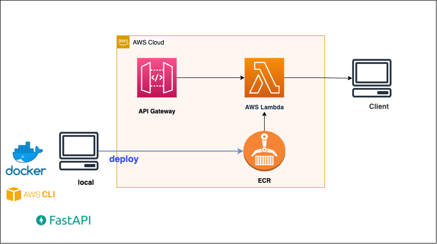

# FastApi - Serverless

## Image



## premise
* AWS IMA Account
* aws configure
* AWS:  aws-cli/2.2.36 Python/3.8.8 Darwin/20.6.0 exe/x86_64 prompt/off
* Docker: 20.10.8, build 3967b7d
* Python: 3.9.1
* serverless: Framework Core: 3.2.1, Plugin: 6.1.0, SDK: 4.3.1
* node: v16.8.0

## Flow
1. Create ECR Repository
2. add `.env`
3. `docker-compose build`
4. `docker push {ECR_IMAGE}:latest`
   * ex: ECR_IMAGE: `123456789123.dkr.ecr.{region}.amazonaws.com/lambda-container`
5. Create Lambda Function
6. `sls deploy`
7. test API endpoint
    ```bash
    $ curl https://xxxxx.execute-api.ap-northeast-1.amazonaws.com/dev/
    {"Hello":"World root !!!!!!!"}%
    ```
   
## Reference
* https://fastapi.tiangolo.com/deployment/docker/
* https://mangum.io/
* https://rafrasenberg.com/posts/deploying-fastapi-on-aws-as-a-lambda-container-image/
* https://www.serverless.com/framework/docs/environment-variables/
* https://dev.classmethod.jp/articles/easy-deploy-of-lambda-with-serverless-framework/
* https://zenn.dev/mini_hiori/articles/mangum-serverless
